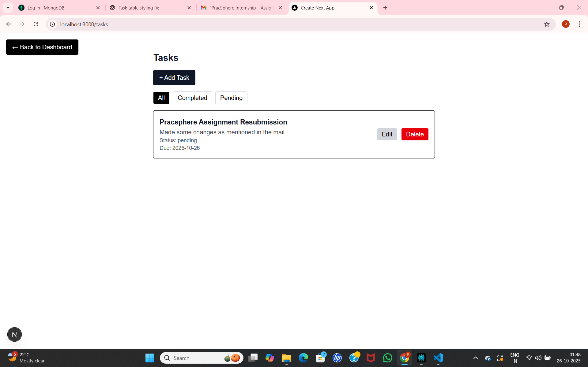
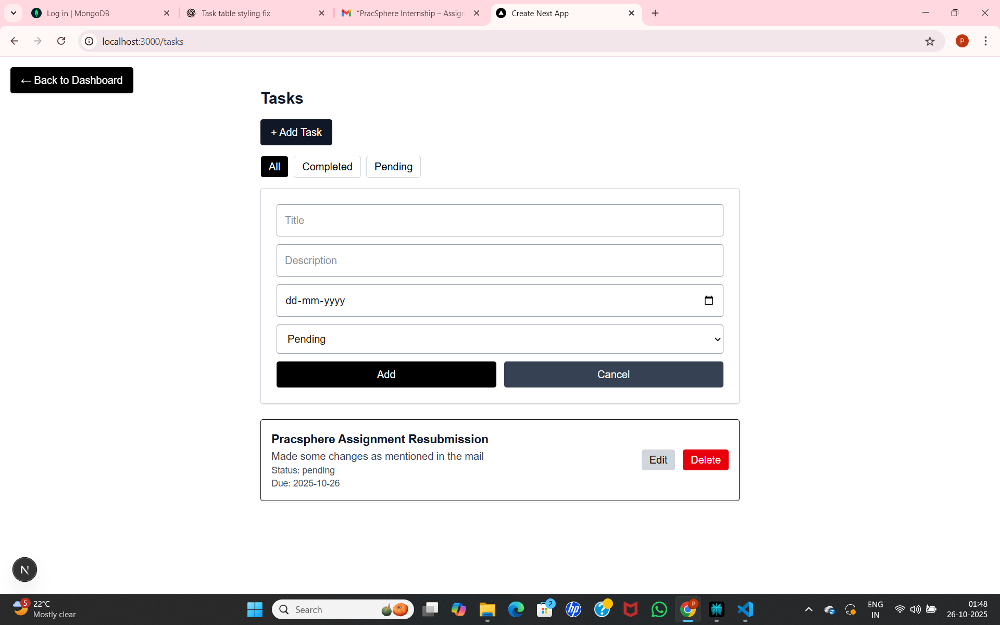

# PracSphere Mono-repo Project

A modern mono-repo built with TypeScript, Next.js, and MongoDB using npm workspaces.  
Centralizes UI components, types, utilities, and database logic for scalable development.

---
### Prerequisites

- Node.js (v18+ recommended)
- npm package manager
- MongoDB instance (local or cloud)

### Setup Instructions

1. Clone the repository:

git clone https://github.com/PurandhareshwariKarre/pracsphere_asessment.git
cd pracsphere_asessment

2. Install dependencies:

npm install

3. Create a `.env.local` file in the project root, based on `.env.example`:

MONGODB_URI=your_mongodb_connection_string
NEXTAUTH_SECRET=your_nextauth_secret_key
NEXTAUTH_URL=http://localhost:3000

4. Run the development server:

### Running the App

Start the development server for the Next.js app:

cd apps/web
npm run dev

5. Open [http://localhost:3000](http://localhost:3000) in your browser.

Access signup at 'sigunup' ,login at '/login' ,dashboard at '/dashboard'.

---

## Features

- Secure authentication flow using NextAuth and MongoDB.
- Responsive Dashboard with Sidebar and Topbar.
- Task manager CRUD with filtering.

---

## Repository Structure

- **apps/web** - Next.js frontend application
- **packages/ui** - Shared React UI components library
- **packages/types** - Shared TypeScript types and interfaces
- **packages/utils** - Utility functions, helpers
- **packages/db** - Database connection and models

---

## Screenshots

### Signup Page

### Login Page

### Dashboard

### Tasks

### AddingTasks

### Profile

### EditingTask

### Signout

---
## Key Notes

- Use shared packages only from `packages/` to avoid duplication.
- Your `tsconfig.json` at root contains `baseUrl` and `paths` for local package aliasing:
---

"baseUrl": ".",
"paths": {
"@repo/types": ["packages/types/index.ts"],
"@repo/ui": ["packages/ui/index.ts"]
}

- If you see a TypeScript `baseUrl` deprecation warning, it can be safely ignored for TypeScript v5 and v6.

---

## Development Commands

- `npm run dev` — Run Next.js dev server
- `npm run build` — Build app and packages
---

### Application URLs
Home page: http://localhost:3000/

Signup page: http://localhost:3000/signup

Dashboard page: http://localhost:3000/dashboard

Login page: http://localhost:3000/login

## Resources

- [Next.js Documentation](https://nextjs.org/docs)
- [NextAuth.js Documentation](https://next-auth.js.org/)

---

## Resources

- [Next.js Documentation](https://nextjs.org/docs)
- [NextAuth.js Documentation](https://next-auth.js.org/)

---
## Contact

Maintained by: `<Purandhareshwari Karre / karrepurandhareshwari@gmail.com>`

---

Thank you for reviewing this project!
