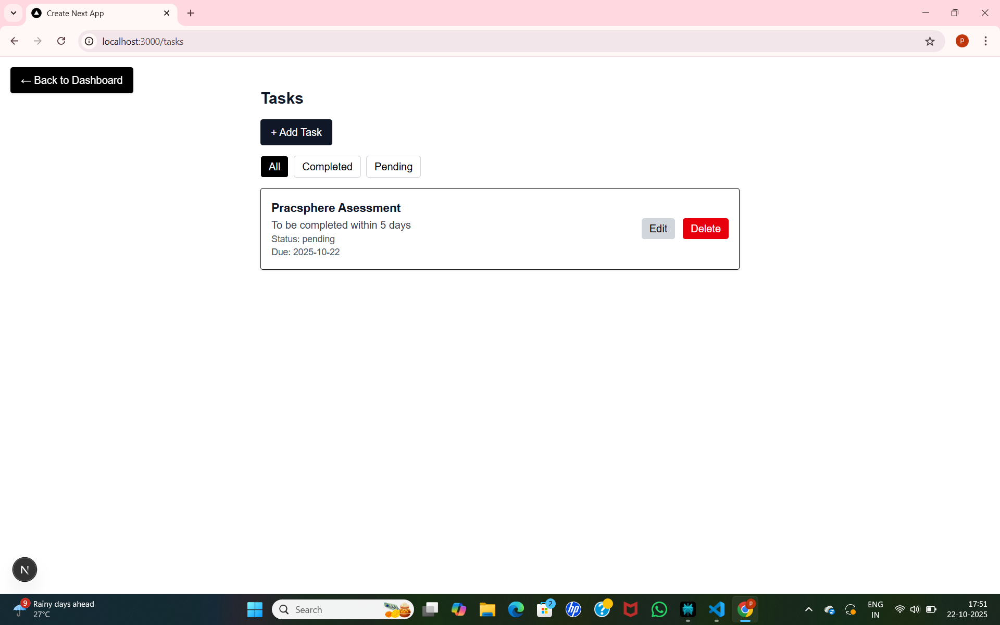
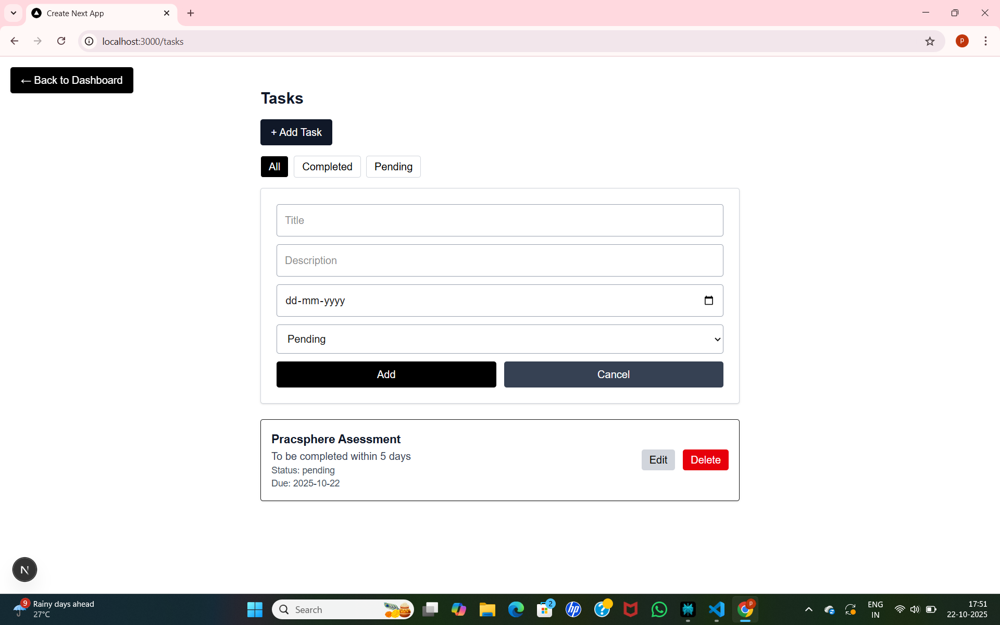
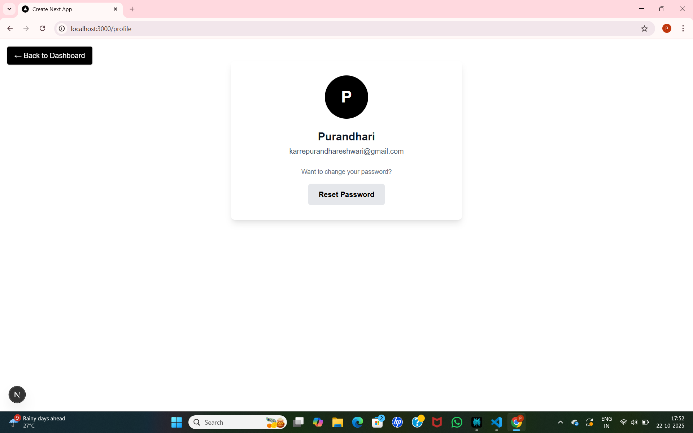
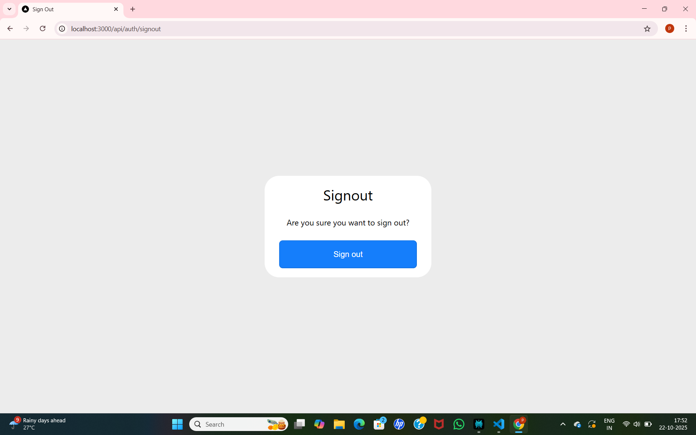

# PracSphere Assignment - Student Developer

This repository contains the full source code for the PracSphere Student Developer assignment.

---

## Getting Started

### Prerequisites

- Node.js (v18+ recommended)
- pnpm or npm package manager
- MongoDB instance (local or cloud)

### Setup Instructions

1. Clone the repository:

git clone https://github.com/yourusername/yourrepo.git
cd yourrepo

2. Install dependencies:

pnpm install   or   npm install

3. Create a `.env.local` file in the project root, based on `.env.example`:

MONGODB_URI=your_mongodb_connection_string
NEXTAUTH_SECRET=your_nextauth_secret_key
NEXTAUTH_URL=http://localhost:3000

4. Run the development server:

pnpm dev  or   npm run dev

5. Open [http://localhost:3000](http://localhost:3000) in your browser.

---

## Features

- Secure authentication flow using NextAuth and MongoDB.
- Responsive Dashboard with Sidebar and Topbar.
- Task manager CRUD with filtering.

---

## Project Structure

- `apps/web` - Next.js frontend app router project.
- `packages/ui` - Shared UI components such as Sidebar, Topbar, TaskList.
- `apps/api` - Backend API routes (if applicable).

---

## Screenshots

### Signup Page

### Login Page

### Dashboard

### Tasks

### AddingTasks

### Profile

### Signout

---

## Notes

- Keep your real `.env` files private and never commit them.
- Use `.env.example` as a template for environment variables.
- Follow `.gitignore` rules to exclude unnecessary folders like `node_modules` or `.next`.

---

## Resources

- [Next.js Documentation](https://nextjs.org/docs)
- [NextAuth.js Documentation](https://next-auth.js.org/)

---

Thank you for reviewing this project!
